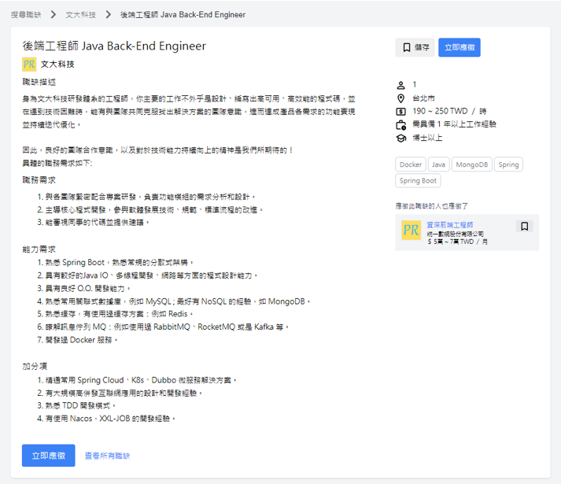

# 企業實習媒合系統
## 開發環境說明
### 1. 專案介紹
> 本系統設計為本校的找實習平台，採用Spring Boot + React + MySQL，開發時間5個月為兩人合作作品，主要目的是想解決找實習過程不夠透明和方便，為了解決這個問題，才萌生製作本專案的想法。我們把專案分成三個身分學生、教師、廠商讓各自擁有可以展示自己優勢的地方，在教師管理方面我們把找實習過程主要分為應徵中、面試中、待學生同意中、實習中讓教師清楚知道現在同學實習的狀況並方便管理，也可以查看學生的履歷讓教師給出他的建議，學生方面我們履歷有可以讓其填寫在校成績跟證照個方面讓她證明他足夠優秀，廠商方面可以讓其介紹該公司的優秀企業文化，我們未來預計希望還可以增加聊天系統。
### 2. 主要功能
- 新增、修改、刪除履歷
- 新增、修改、職位訊息
- 新增、修改、公司相關資訊
- 審核職缺
- 審核學生、公司身分
- 追蹤職缺
- 顯示職位訊息
- 顯示履歷
- 帳號管理(由教師審核學生跟公司跟職位是否能上架)
- 配對管理可以改變學生(公司跟教師共同監管)
- 歷史系統(方便管理何方做了何種改變跟選擇)
- 上傳公告(讓所有學生下載的地方)
- 上傳履歷(讓學生上傳履歷)
- 上傳圖片(個人或公司圖片)
### 3. 作業系統
- Windows 7 以上版本 
- Mac OS X 10.6 以上版本
### 4. 版本控制
- git
- 首次使用 Git 必須做的設定 (必要設定)
    - 請開啟命令提示字元或終端機視窗，並輸入以下指令進行設定，這是使用 Git 之前的必要步驟：
    - 設定您的名稱: git config --global userName 您的名稱
    - 設定電子郵件: git config --global userEmail 您的電子郵件
### 5. 開發工具
- Visual Studio Code
  - 使用到擴充套件(詳細請至檔案觀看)
    - React
    - Redux
    - TypeScript   
    - NextJS
    - Tanstack-query
    - MUI
    - TailwindCSS
    - Lexical
    - framer-motion
    - react-image-crop
- Intelij IDEA
  - 使用到擴充套件(詳細請至檔案觀看)
    - Spring Boot
    - Spring MVC
    - Spring Security
    - Hibernate
    - JPA
    - jjwt-jackson
    - lombok
- Node.js 
  - 詳細教學請至[Node.js安裝教學](https://dotblogs.com.tw/jamestsai/2022/03/13/Install-nodejs-and-npm-on-Windows)
- My SQL
  - 詳細教學請至[MY SQL安裝教學](https://ithelp.ithome.com.tw/articles/10259766)
### 6. 遇到困難
- JPA對複雜SQL語法支持度較低(用JDBC解決)
- Spring Security非常複雜(還沒法全部理解)
- Next.js13非常複雜(還沒法全部理解)
- 前後端溝通問題(連結性太高現在會分V1,V2)
- 富文本編輯器(嘗試過許多編輯器，最後決定用Lexical)
- 沒有實際UI設計的經驗，網站呈現是模仿 CakeResume、104、1111 的風格
### 7. 未來改進
- if else太多(有想用工廠模式改寫)
- 新增聊天室系統

### 8. 實際畫面
- ### 選擇註冊身分

- ### 先行驗證email

- ### 學生註冊

- ### 教師註冊

- ### 公司註冊

- ### 職缺篩選條件

- ### 職缺篩選條件(依地址篩選)

- ### 職缺篩選條件(以薪水進行篩選)

- ### 職缺篩選條件(以技術進行篩選)

- ### 職缺瀏覽頁面

- ### 公司檢查自己的職缺

- ### 履歷

- ### 公司相關資訊

- ### 職缺審核

- ### 公司審核

- ### 學生審核

- ### 應徵審核

- ### 應徵改變

